# ElastiCache Redis Comprehensive Guide

## Table of Contents
1. [Core Terminology](#core-terminology)
2. [Redis Architecture Overview](#redis-architecture-overview)
3. [Cluster vs Non-Cluster Mode](#cluster-vs-non-cluster-mode)
4. [Replication and High Availability](#replication-and-high-availability)
5. [Scaling Strategies](#scaling-strategies)
6. [Handling Heavy Traffic](#handling-heavy-traffic)
7. [Real-World Examples](#real-world-examples)

---

## Core Terminology

### **Primary Node (Master)**
- The main Redis node that handles all write operations
- Processes read operations when no replicas are available
- Maintains the authoritative copy of data
- Can have multiple replica nodes attached to it

### **Replica Node (Slave/Secondary)**
- Read-only copy of the primary node
- Receives data updates asynchronously from the primary
- Used to scale read operations and provide redundancy
- Can be promoted to primary if the original primary fails

### **Redis Cluster**
- A distributed setup with multiple primary nodes
- Data is automatically partitioned (sharded) across nodes
- Each primary can have its own replica nodes
- Provides horizontal scaling and high availability

### **Shard (Hash Slot)**
- A subset of data distributed across cluster nodes
- Redis Cluster uses 16,384 hash slots
- Each primary node is responsible for a range of hash slots
- Keys are mapped to hash slots using CRC16 algorithm

### **Replication Group**
- A collection of one primary and zero or more replica nodes
- All nodes in the group contain the same data
- Provides read scaling and automatic failover capability

### **Node Group**
- In cluster mode, a node group contains one primary and its replicas
- Equivalent to a replication group in cluster context
- Each node group handles a specific range of hash slots

### **Endpoint**
- Connection string used to access Redis nodes
- **Primary Endpoint**: Write operations endpoint
- **Reader Endpoint**: Read operations endpoint (load balanced across replicas)
- **Configuration Endpoint**: Cluster mode discovery endpoint

### **Failover**
- Process of promoting a replica to primary when the original primary fails
- Can be automatic (AWS handles it) or manual
- Minimizes downtime and data loss

---

## Redis Architecture Overview

### Single Node Architecture

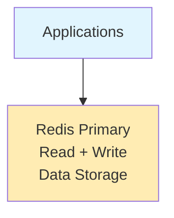

**Characteristics:**
- ✓ Simple setup
- ✓ Low latency
- ✗ Single point of failure
- ✗ Limited by single node capacity

### Primary-Replica Architecture

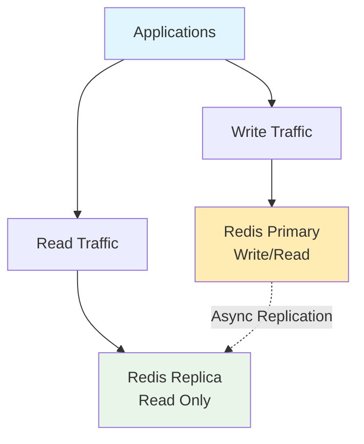

**Benefits:**
- ✓ Read scaling
- ✓ High availability
- ✓ Automatic failover
- ✗ Write operations still limited to primary

---

## Cluster vs Non-Cluster Mode

### Non-Cluster Mode - Replication Group

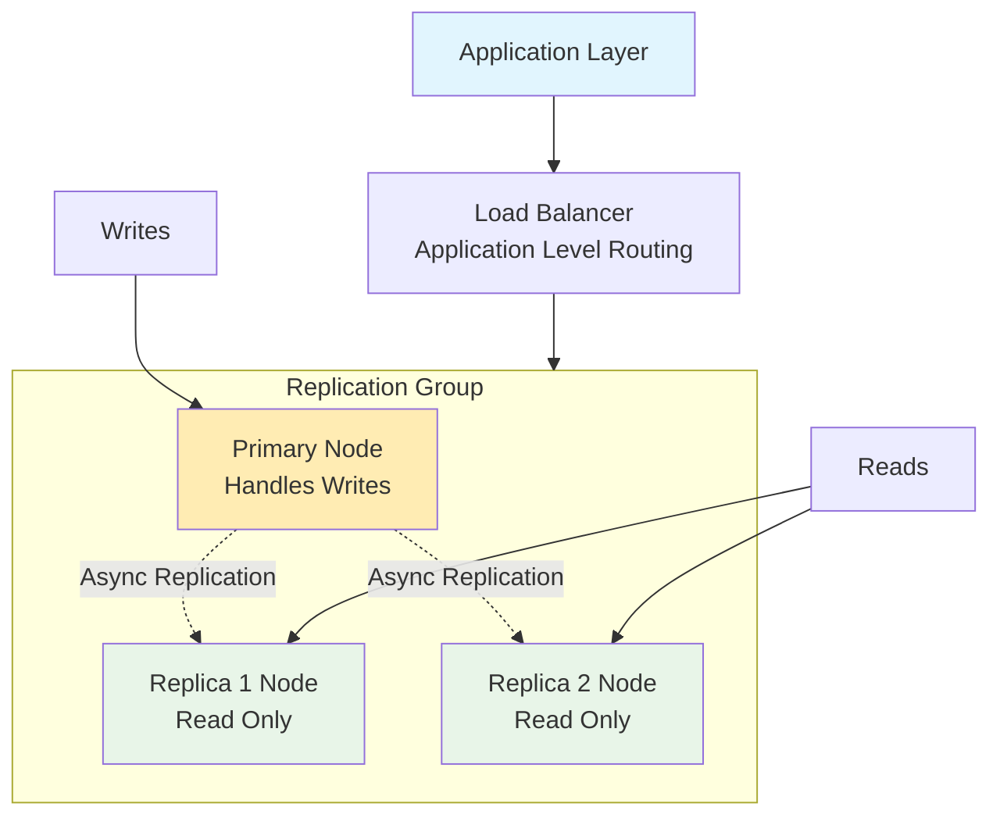

**Characteristics:**
- Single primary handles all writes
- Up to 5 replica nodes
- Manual sharding required for scaling writes
- Simpler configuration and management

### Cluster Mode

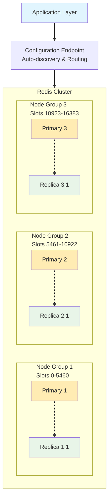

**Characteristics:**
- Multiple primaries handle writes
- Automatic data sharding across nodes
- Horizontal scaling capability
- Built-in high availability
- Up to 500 nodes total

---

## Replication and High Availability

### Data Flow in Replication

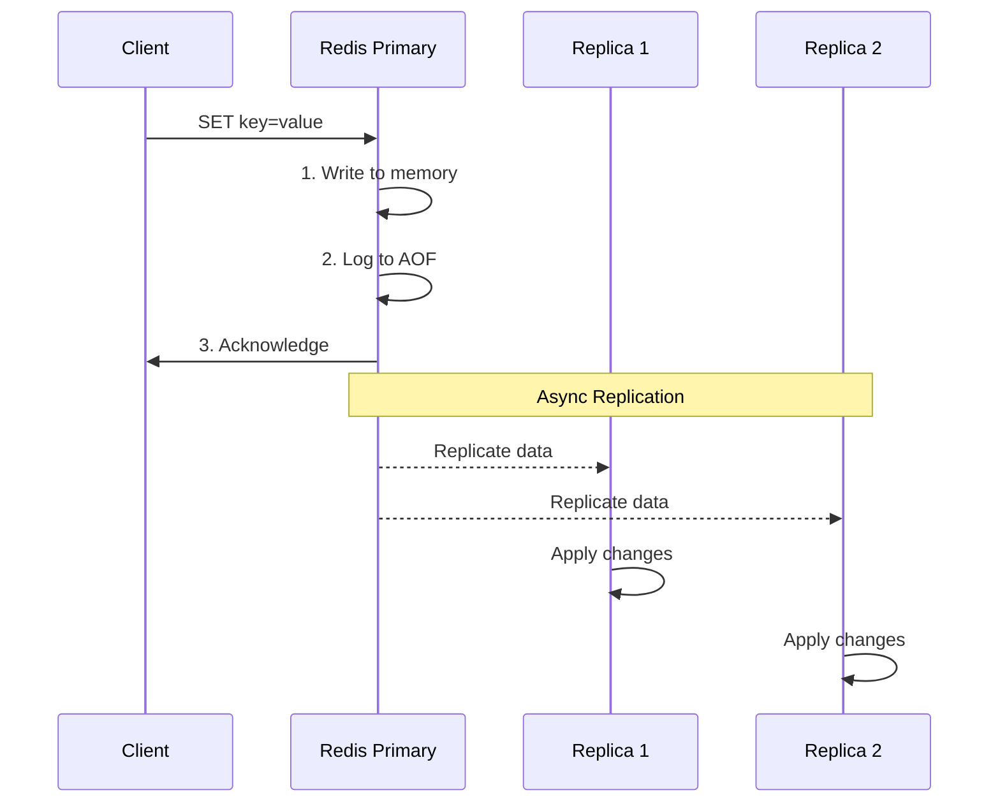

### Automatic Failover Process

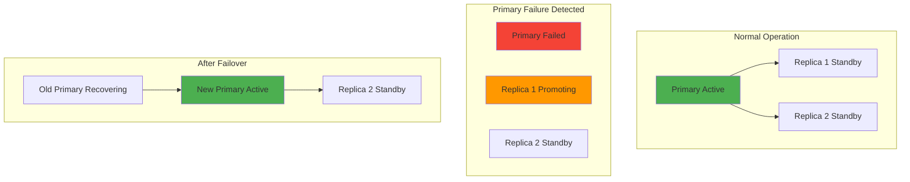

**Failover Steps:**
1. Health check failure detected
2. Replica with lowest replication lag selected
3. Replica promoted to primary
4. DNS endpoint updated
5. Applications reconnect automatically
6. Old primary becomes replica when recovered

---

## Scaling Strategies

### Vertical Scaling - Scale Up

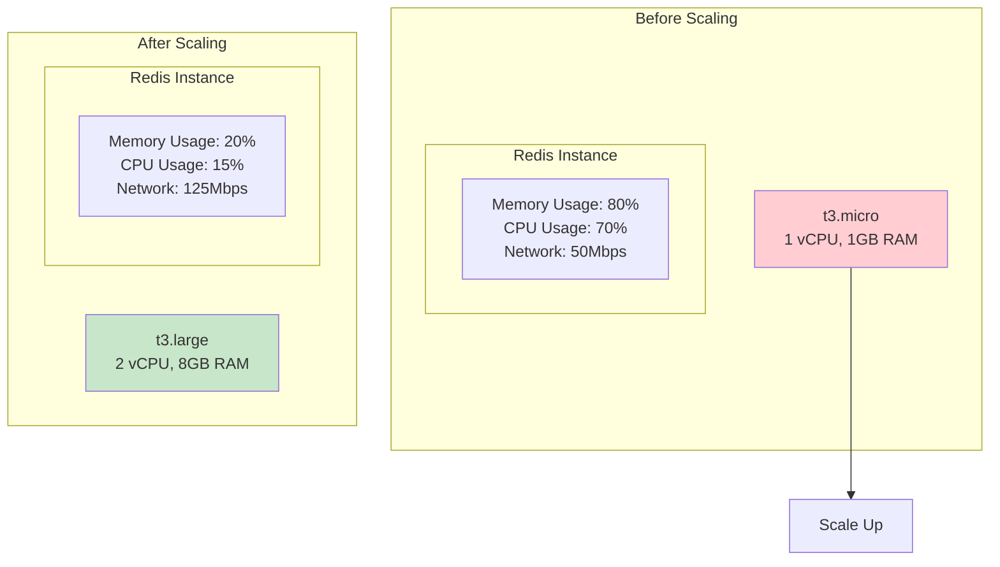

**Benefits:** ✓ Higher performance per node, ✓ More memory for caching  
**Limits:** ✗ Single point of failure, ✗ Upper limit on instance size

### Horizontal Scaling - Read Replicas

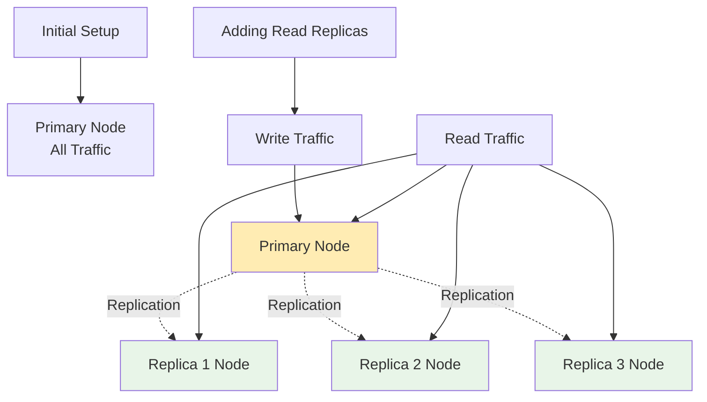

**Traffic Distribution:**
- Primary: 100% writes + 25% reads
- Each Replica: 25% reads
- Total read capacity: 4x improvement

### Horizontal Scaling - Cluster Mode Evolution

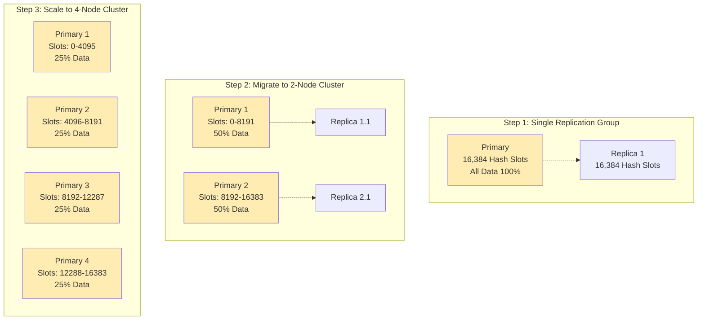

**Benefits:**
- Write capacity scales linearly
- Data automatically redistributed
- No single point of failure
- Supports up to 500 nodes

### Scaling Decision Matrix

| Traffic Type | Recommended Scaling | Architecture |
|--------------|-------------------|--------------|
| Read Heavy (80% Read) | Add Read Replicas | Primary + Multiple Replicas |
| Write Heavy (60%+ Write) | Enable Cluster Mode | Multiple Primary Nodes |
| Memory Limited (High Hit Rate) | Vertical Scale or Cluster | Larger Instance Types |
| High Throughput (Mixed Load) | Cluster Mode + Read Replicas | Multiple Nodes + Replicas |

---

## Handling Heavy Traffic

### Connection Management Strategy

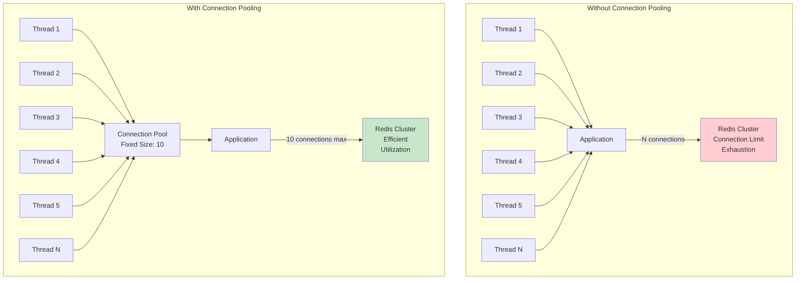

**Benefits:**
- ✓ Reduced connection overhead
- ✓ Better resource utilization
- ✓ Connection reuse
- ✓ Controlled resource usage

### Caching Patterns for High Traffic

#### Cache-Aside Pattern

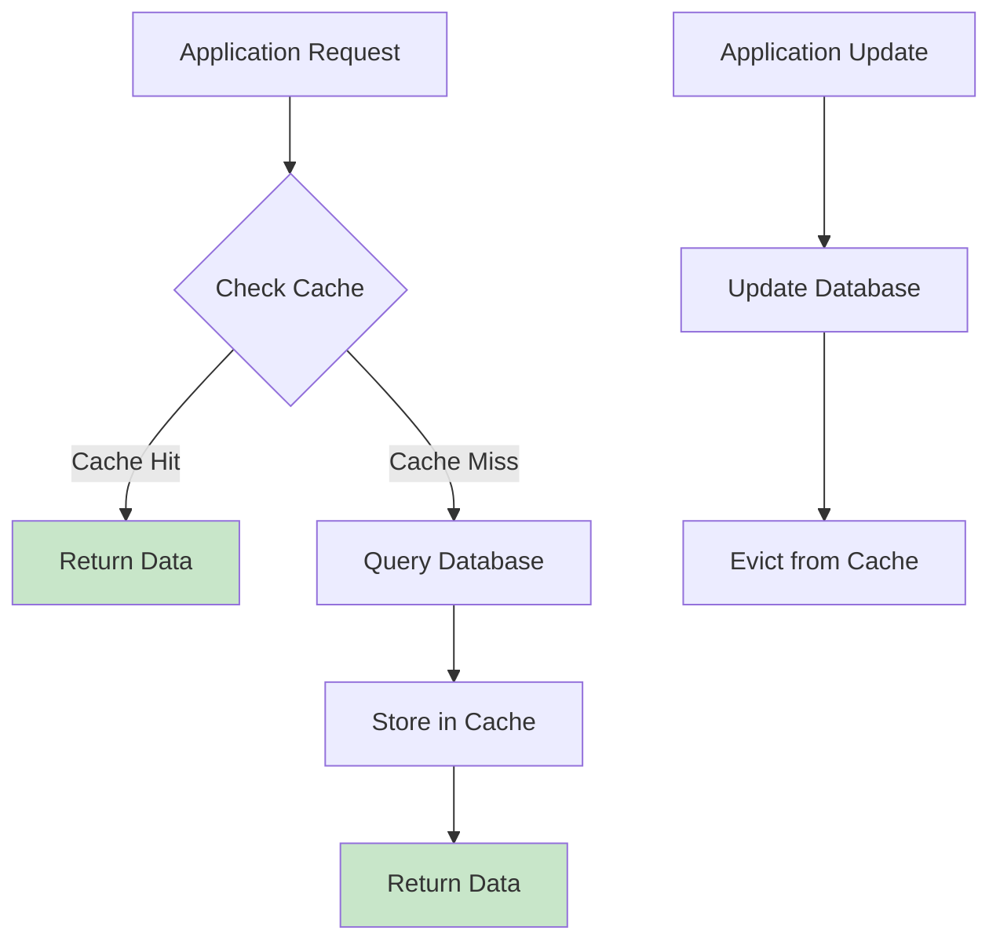

#### Write-Through Pattern

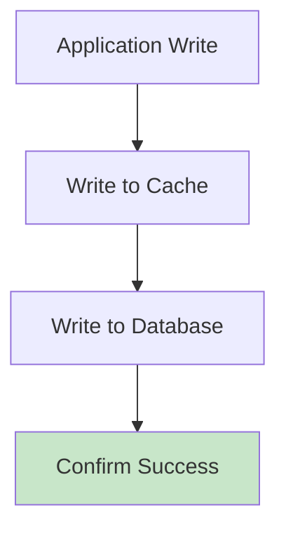

**Benefits:** ✓ Data consistency, ✓ Always fresh data  
**Drawbacks:** ✗ Higher write latency, ✗ Cache may contain unused data

### Geographic Distribution

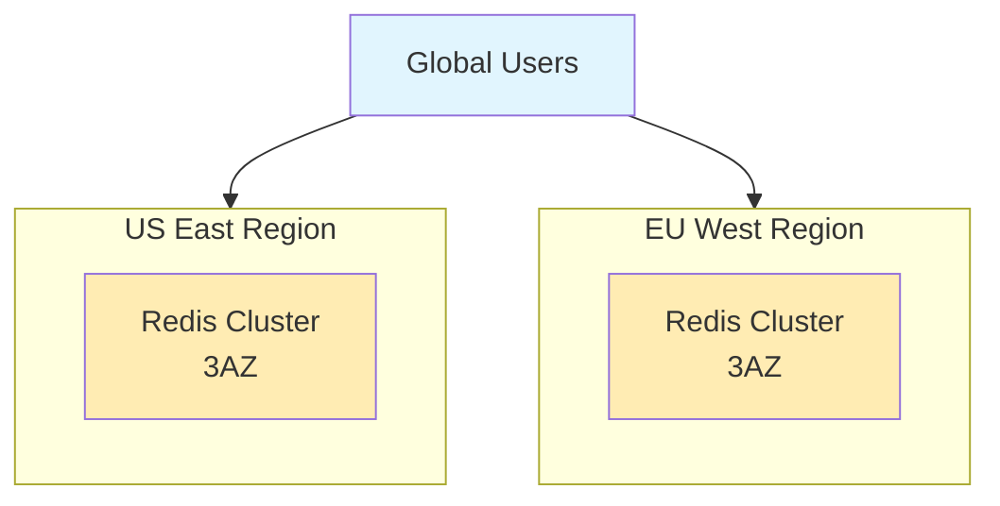

**Benefits:**
- ✓ Reduced latency
- ✓ Data locality
- ✓ Fault isolation
- ✓ Compliance requirements

### Performance Optimization Hierarchy

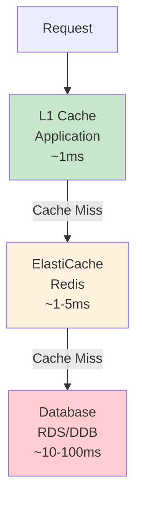

**Optimization Strategies:**
1. **Batch Operations**
   - MGET for multiple keys
   - Pipeline commands
   - Reduce network round trips

2. **Data Structure Selection**
   - Hash for objects
   - Sets for unique collections
   - Sorted sets for rankings
   - Lists for queues

3. **TTL Management**
   - Set appropriate expiration
   - Avoid thundering herd
   - Use jitter for staggered expiry

### Circuit Breaker Pattern for Resilience

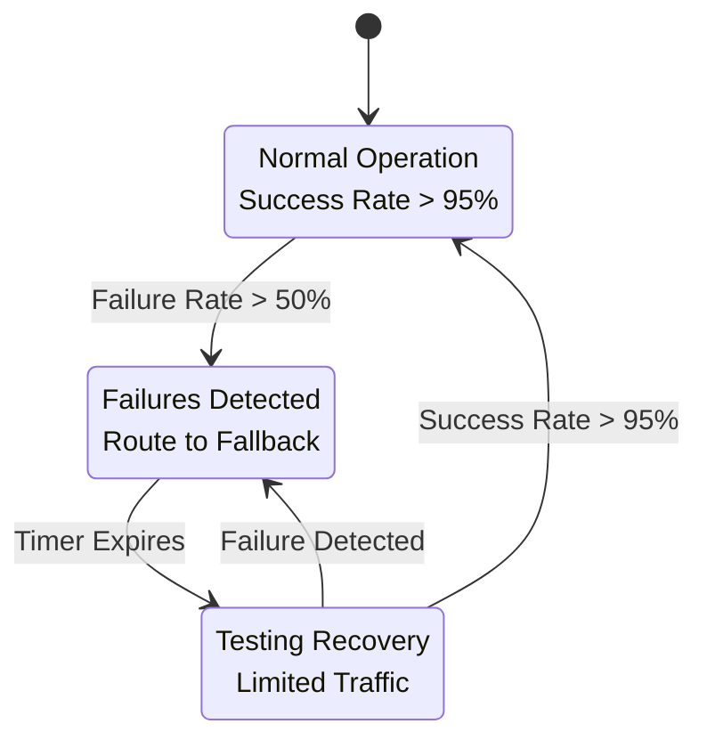

---

## Real-World Examples

### Example 1: E-commerce Platform Scaling Journey

#### Phase 1: Small Store - 0-1K users

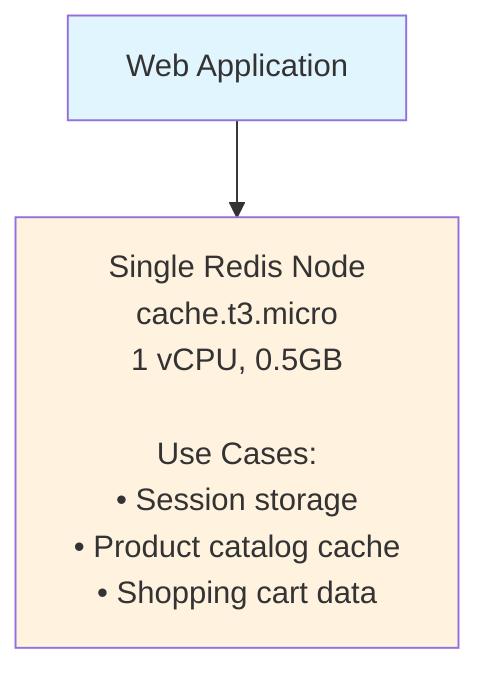

**Cost:** ~$15/month  
**Performance:** Handles 10-50 RPS

#### Phase 2: Growing Business - 1K-10K users

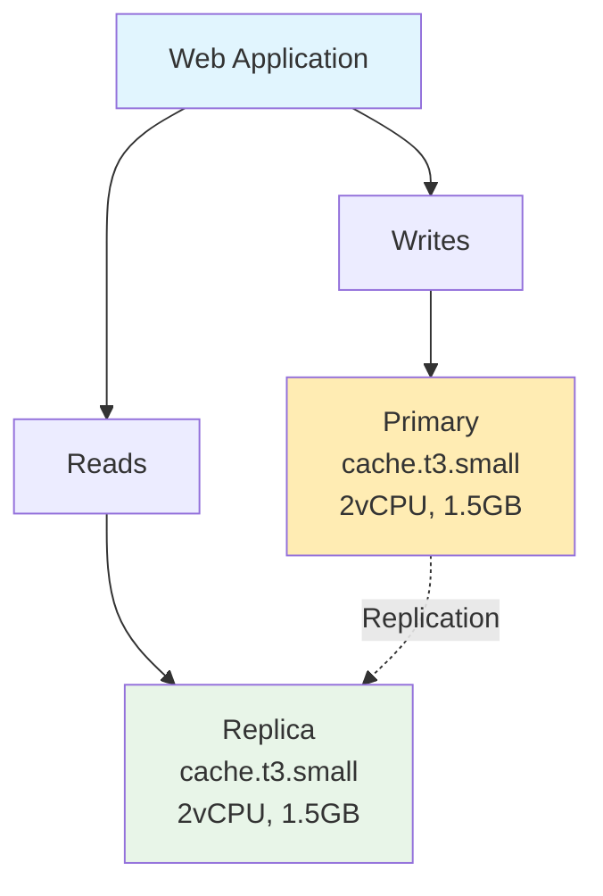

**Cost:** ~$60/month  
**Performance:** Handles 100-500 RPS  
**Benefits:**
- Read scaling
- High availability
- Zero-downtime deployments

#### Phase 3: High-Traffic Platform - 10K-100K users

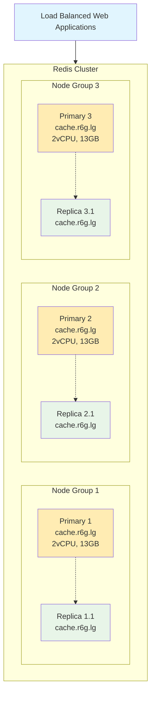

**Cost:** ~$800/month  
**Performance:** Handles 1K-10K RPS  
**Benefits:**
- Linear write scaling
- 78GB total memory
- Automatic sharding
- Multi-AZ deployment

### Example 2: Real-time Gaming Platform

#### Game Architecture with Redis Operations

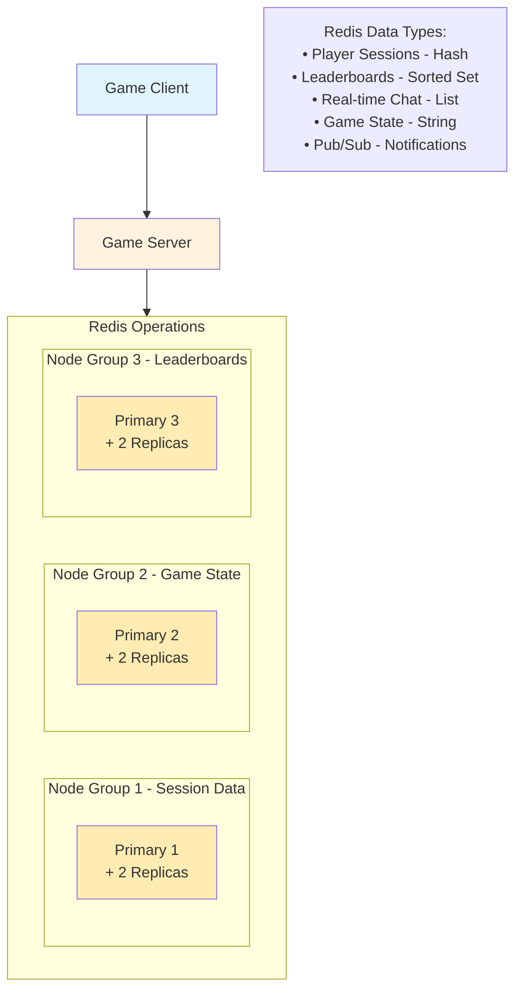

**Performance Requirements:**
- < 1ms latency for session lookups
- Handle 50K concurrent players
- Real-time leaderboard updates
- 99.99% availability

### Example 3: Social Media Platform Multi-Level Caching

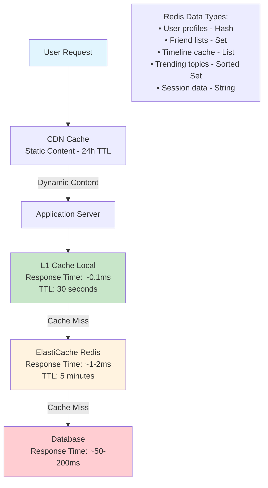

**Cache Hit Rates:**
- L1 Cache: 85% hit rate
- Redis Cache: 12% hit rate  
- Database: 3% hit rate

**Performance Impact:**
- Average response time: ~5ms
- 97% reduction in database load
- Support for 1M+ concurrent users

### Example 4: Financial Services - High Availability Multi-Region Setup

```mermaid
graph TD
    subgraph A [Primary Region - US-East-1]
        subgraph B [AZ-1a]
            C[Primary Node<br/>Transaction Data]
        end
        
        subgraph D [AZ-1b]
            E[Replica Node<br/>Synchronous Rep]
        end
        
        C -.->|Sync Replication| E
    end
    
    A -.->|Cross-Region Replication| F
    
    subgraph F [Disaster Recovery - US-West-2]
        subgraph G [AZ-2a]
            H[Standby Node<br/>Asynchronous Rep]
        end
    end
    
    style C fill:#4caf50
    style E fill:#2196f3
    style H fill:#ff9800
```

**Regulatory Requirements:**
- Zero data loss tolerance
- 99.999% availability (5.26 min downtime/year)
- Disaster recovery within 15 minutes
- Data encryption at rest and in transit
- Audit logging for all operations

**Failover Strategy:**
1. Health check failure detected (< 30 seconds)
2. Automatic failover to AZ-1b replica (< 60 seconds)
3. If entire region fails, manual promotion of DR site (< 15 minutes)
4. Data consistency verification before resuming operations

---

## Best Practices Summary

### When to Use Different Configurations

#### Single Node - Development/Testing

**Suitable for:**
- ✓ Development environments
- ✓ Proof of concepts
- ✓ Applications with < 1K users
- ✓ Non-critical workloads

**Example Use Cases:**
- User session storage
- Simple caching layer
- Development testing

#### Primary + Replicas - Production Ready

**Suitable for:**
- ✓ Production applications
- ✓ Read-heavy workloads
- ✓ Applications requiring high availability
- ✓ 1K - 50K users

**Example Use Cases:**
- E-commerce product catalogs
- Content management systems
- Social media feeds
- Gaming leaderboards

#### Cluster Mode - Enterprise Scale

**Suitable for:**
- ✓ Large-scale applications
- ✓ Write-heavy workloads
- ✓ Applications with > 50K users
- ✓ Mission-critical systems

**Example Use Cases:**
- Real-time analytics
- High-frequency trading
- Massive multiplayer games
- IoT data processing

### Performance Tuning Guidelines

**Memory Optimization:**
1. **Use appropriate data types**
   - Hash for objects (more memory efficient than JSON strings)
   - Sets for unique collections
   - Sorted sets for rankings

2. **Set TTL appropriately**
   - Short TTL for frequently changing data (1-5 minutes)
   - Long TTL for relatively static data (1-24 hours)
   - Use EXPIRE command strategically

3. **Monitor memory usage**
   - Keep below 80% capacity
   - Use memory optimization commands
   - Regular cleanup of expired keys

**Network Optimization:**
1. Use pipelining for batch operations
2. Minimize network round trips
3. Use connection pooling
4. Implement retry logic with exponential backoff

**Monitoring and Alerting:**
1. **Key Metrics to Monitor:**
   - CPU utilization (< 80%)
   - Memory utilization (< 80%)
   - Network throughput
   - Cache hit ratio (> 80%)
   - Connection count
   - Latency (< 1ms for most operations)

2. **Set up alerts for:**
   - High memory usage
   - Failover events
   - Slow queries
   - Connection limit approach

This comprehensive guide covers all the essential aspects of ElastiCache Redis, from basic terminology to advanced scaling strategies. The visual diagrams and real-world examples should help you understand how to implement and scale Redis effectively based on your specific use case and traffic patterns.
