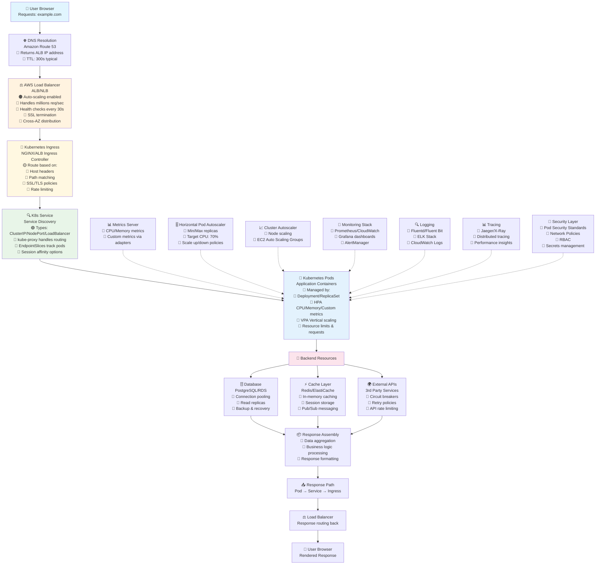

# Kubernetes Traffic Flow Diagram

```mermaid
graph TD
    A[👤 User Browser<br/>Requests: example.com] --> B[🌐 DNS Resolution<br/>Amazon Route 53<br/>🔹 Returns ALB IP address<br/>🔹 TTL: 300s typical]
    
    B --> C[⚖️ AWS Load Balancer<br/>ALB/NLB<br/>🟠 Auto-scaling enabled<br/>🔹 Handles millions req/sec<br/>🔹 Health checks every 30s<br/>🔹 SSL termination<br/>🔹 Cross-AZ distribution]
    
    C --> D[🎯 Kubernetes Ingress<br/>NGINX/ALB Ingress Controller<br/>🟡 Route based on:<br/>🔹 Host headers<br/>🔹 Path matching<br/>🔹 SSL/TLS policies<br/>🔹 Rate limiting]
    
    D --> E[🔍 K8s Service<br/>Service Discovery<br/>🟢 Types: ClusterIP/NodePort/LoadBalancer<br/>🔹 kube-proxy handles routing<br/>🔹 EndpointSlices track pods<br/>🔹 Session affinity options]
    
    E --> F[🚀 Kubernetes Pods<br/>Application Containers<br/>🔵 Managed by:<br/>🔹 Deployment/ReplicaSet<br/>🔹 HPA CPU/Memory/Custom metrics<br/>🔹 VPA Vertical scaling<br/>🔹 Resource limits & requests]
    
    F --> G[💾 Backend Resources]
    
    G --> G1[🗄️ Database<br/>PostgreSQL/RDS<br/>🔹 Connection pooling<br/>🔹 Read replicas<br/>🔹 Backup & recovery]
    
    G --> G2[⚡ Cache Layer<br/>Redis/ElastiCache<br/>🔹 In-memory caching<br/>🔹 Session storage<br/>🔹 Pub/Sub messaging]
    
    G --> G3[🌍 External APIs<br/>3rd Party Services<br/>🔹 Circuit breakers<br/>🔹 Retry policies<br/>🔹 API rate limiting]
    
    G1 --> H[📦 Response Assembly<br/>🔹 Data aggregation<br/>🔹 Business logic processing<br/>🔹 Response formatting]
    G2 --> H
    G3 --> H
    
    H --> I[📤 Response Path<br/>Pod → Service → Ingress]
    I --> J[⚖️ Load Balancer<br/>Response routing back]
    J --> K[👤 User Browser<br/>Rendered Response]
    
    %% Auto-scaling components
    L[📊 Metrics Server<br/>🔹 CPU/Memory metrics<br/>🔹 Custom metrics via adapters] -.-> F
    M[🎚️ Horizontal Pod Autoscaler<br/>🔹 Min/Max replicas<br/>🔹 Target CPU: 70%<br/>🔹 Scale up/down policies] -.-> F
    N[📈 Cluster Autoscaler<br/>🔹 Node scaling<br/>🔹 EC2 Auto Scaling Groups] -.-> F
    
    %% Monitoring & Observability
    O[📱 Monitoring Stack<br/>🔹 Prometheus/CloudWatch<br/>🔹 Grafana dashboards<br/>🔹 AlertManager] -.-> F
    P[🔍 Logging<br/>🔹 Fluentd/Fluent Bit<br/>🔹 ELK Stack<br/>🔹 CloudWatch Logs] -.-> F
    Q[📊 Tracing<br/>🔹 Jaeger/X-Ray<br/>🔹 Distributed tracing<br/>🔹 Performance insights] -.-> F
    
    %% Security
    R[🔐 Security Layer<br/>🔹 Pod Security Standards<br/>🔹 Network Policies<br/>🔹 RBAC<br/>🔹 Secrets management] -.-> F
    
    style A fill:#e1f5fe
    style C fill:#fff3e0
    style D fill:#fff8e1
    style E fill:#e8f5e8
    style F fill:#e3f2fd
    style G fill:#fce4ec
```
