# Complete Proxy Guide: Real-World Usage & Examples

## What is a Proxy?

A **proxy** is an intermediary server that sits between a client (like your web browser) and a target server (like a website). Think of it as a middleman or gateway that forwards requests and responses between two parties.

### 🤔 **Simple Analogy**
Imagine you want to buy something from a store in another country:
- **Without Proxy**: You travel directly to the foreign store yourself
- **With Proxy**: You ask a local representative to go to the store for you, buy the item, and bring it back

### 🔧 **How Proxies Work**
1. **Client** sends a request to the **Proxy Server**
2. **Proxy Server** forwards the request to the **Target Server**
3. **Target Server** sends response back to the **Proxy Server**
4. **Proxy Server** delivers the response to the **Client**

During this process, the proxy can:
- **Modify requests** (add security headers, change routing)
- **Cache responses** (store frequently requested data)
- **Filter content** (block malicious or inappropriate content)
- **Load balance** (distribute requests across multiple servers)
- **Provide security** (hide client identity, block attacks)

### 📊 **Why Companies Use Proxies**
- **Security**: Block malicious traffic and protect sensitive data
- **Performance**: Cache content and reduce server load
- **Scalability**: Distribute traffic across multiple servers
- **Control**: Monitor and filter internet access
- **Compliance**: Meet regulatory requirements for data protection

## Overview
This comprehensive guide explains different types of proxies through real-world examples and use cases. Proxies are used by companies worldwide to solve critical infrastructure challenges and enable global-scale applications.

## 🎯 **Real-World Proxy Impact**

**Companies like Netflix, Amazon, Google, and Facebook rely heavily on proxy technologies to serve billions of users daily.**

**What Proxies Enable:**
- 🔒 **Security** - Protecting against cyber attacks and data breaches
- ⚡ **Performance** - Reducing page load times from seconds to milliseconds
- 🌐 **Global Scale** - Serving content to users worldwide efficiently
- 📊 **Reliability** - Ensuring 99.99% uptime for critical services
- � **Cost Savings** - Reducing bandwidth and server costs by up to 60%

## Table of Contents
- [Forward Proxy vs Reverse Proxy](#forward-proxy-vs-reverse-proxy)
- [Nginx Reverse Proxy](#nginx-reverse-proxy)
- [Load Balancer Proxy](#load-balancer-proxy)
- [API Gateway Proxy](#api-gateway-proxy)
- [CDN (Content Delivery Network)](#cdn-content-delivery-network)
- [SSL/TLS Termination Proxy](#ssltls-termination-proxy)
- [Caching Proxy](#caching-proxy)
- [Security Proxy (WAF)](#security-proxy-waf)
- [Real-World Examples](#real-world-examples)

---

## Forward Proxy vs Reverse Proxy

### **What are Forward and Reverse Proxies?**

**Forward Proxy**: Acts on behalf of clients (users) to access servers. The server doesn't know the real client identity - it only sees the proxy. Commonly used for corporate internet filtering, privacy protection, and accessing geo-restricted content.

**Reverse Proxy**: Acts on behalf of servers to handle client requests. The client doesn't know which actual server processed their request - they only see the proxy. Commonly used for load balancing, SSL termination, and protecting backend servers.

**Key Difference**: Forward proxy hides the client from the server, while reverse proxy hides the server from the client.

### 🔄 **Proxy Types Overview**

```mermaid
graph TB
    subgraph "Forward Proxy Flow"
        Client1[👨‍💻 Client] --> FProxy[🔄 Forward Proxy<br/>Squid, Corporate Proxy]
        FProxy --> Internet[🌐 Internet/External Servers]
        Internet --> FProxy
        FProxy --> Client1
    end
    
    subgraph "Reverse Proxy Flow"
        Client2[👨‍💻 Client] --> Internet2[🌐 Internet]
        Internet2 --> RProxy[🔄 Reverse Proxy<br/>Nginx, HAProxy, Cloudflare]
        RProxy --> Server1[🖥️ Server 1]
        RProxy --> Server2[🖥️ Server 2]
        RProxy --> Server3[🖥️ Server 3]
    end
    
    style FProxy fill:#e1f5fe
    style RProxy fill:#e8f5e8
    style Client1 fill:#fff3e0
    style Client2 fill:#fff3e0
```

### **📊 Forward Proxy vs Reverse Proxy Comparison**

| Aspect | Forward Proxy | Reverse Proxy |
|--------|---------------|---------------|
| **Purpose** | Hides client identity from servers | Hides server details from clients |
| **Who Controls** | Client or organization | Server or service provider |
| **Traffic Direction** | Client → Proxy → Server | Client → Proxy → Multiple Servers |
| **Use Cases** | Corporate filtering, anonymity | Load balancing, SSL termination |
| **Real Examples** | Corporate firewalls, VPNs | Netflix CDN, Amazon CloudFront |

### **🏢 Real-World Forward Proxy Examples**

**Corporate Networks:**
- **Goldman Sachs** uses forward proxies to monitor and filter employee internet access, ensuring compliance with financial regulations
- **Government Agencies** use forward proxies to block access to social media and non-work sites during office hours
- **Schools & Universities** filter inappropriate content and limit bandwidth usage for students

**Privacy & Anonymity:**
- **VPN Services** like NordVPN and ExpressVPN act as forward proxies to hide user locations
- **Tor Network** uses multiple forward proxies to provide anonymous browsing
- **Journalists & Activists** in restricted countries use forward proxies to access blocked websites

**Benefits Achieved:**
- Goldman Sachs reduced security incidents by 70% through proxy filtering
- Educational institutions save 40% on bandwidth costs
- VPN companies enable access to geo-restricted content for millions of users

### **🌐 Real-World Reverse Proxy Examples**

**Major Tech Companies:**
- **Netflix** uses reverse proxies to distribute content globally, reducing streaming delays by 80%
- **Facebook** handles 4 billion API requests daily through reverse proxy load balancing
- **Shopify** uses reverse proxies to manage traffic spikes during Black Friday sales

**E-commerce Platforms:**
- **Amazon** uses reverse proxies to handle millions of product page requests simultaneously
- **eBay** routes traffic between different services (search, payments, user accounts) through reverse proxies
- **Alibaba** manages traffic across multiple data centers in different countries

**Media & Content:**
- **YouTube** uses reverse proxies to serve video content from the nearest server location
- **Spotify** distributes music streaming through geographic reverse proxy clusters
- **CNN** handles breaking news traffic spikes through reverse proxy load distribution

---

## Nginx Reverse Proxy

### **What is Nginx Reverse Proxy?**

Nginx is a high-performance web server that excels as a reverse proxy. It sits in front of backend application servers and handles incoming client requests by routing them to appropriate backend services. Nginx can distribute traffic, serve static files directly, handle SSL encryption, and provide a single entry point for complex multi-service applications.

**Primary Functions**: Traffic routing, load distribution, SSL termination, static file serving, and request/response modification.

### 🌐 **Nginx as Reverse Proxy**

```mermaid
graph TD
    Internet[🌐 Internet] --> Nginx[🔄 Nginx Reverse Proxy<br/>Port 80/443]
    
    Nginx --> |/api/*| Backend[🖥️ Backend API<br/>Node.js:3000]
    Nginx --> |/static/*| Static[📁 Static Files<br/>Port 8080]
    Nginx --> |/*| Frontend[⚛️ React App<br/>Port 3000]
    
    Nginx --> |Load Balance| App1[🖥️ App Instance 1<br/>Port 3001]
    Nginx --> |Load Balance| App2[🖥️ App Instance 2<br/>Port 3002]
    Nginx --> |Load Balance| App3[🖥️ App Instance 3<br/>Port 3003]
    
    style Nginx fill:#e8f5e8
    style Backend fill:#e1f5fe
    style Frontend fill:#f3e5f5
    style Static fill:#fff3e0
```

### **⚙️ Real-World Nginx Reverse Proxy Usage**

**High-Traffic Websites:**
- **GitHub** uses Nginx reverse proxies to handle millions of code repository requests daily
- **WordPress.com** serves 409 million people monthly through Nginx reverse proxy clusters
- **Dropbox** routes file upload/download requests through Nginx proxies for optimal performance

**Microservices Architecture:**
- **Uber** uses Nginx to route ride requests between 2,000+ microservices
- **Netflix** routes streaming requests between content delivery, user management, and recommendation services
- **Airbnb** manages booking, payment, and messaging services through centralized Nginx proxies

**E-commerce Scaling:**
- **Etsy** handles craft marketplace traffic spikes during holiday seasons
- **Best Buy** manages online and mobile app traffic through unified Nginx proxy layer
- **Target** routes between inventory, pricing, and customer service APIs

**Real Impact Achieved:**
- GitHub reduced server response times by 60% after implementing Nginx reverse proxies
- WordPress.com handles 24 billion page views monthly with 99.9% uptime
- Uber processes 15 million trips daily through efficient proxy routing

**Common Routing Patterns:**
- **API Requests** → Backend microservices (user, product, order services)
- **Static Files** → CDN or dedicated file servers
- **Admin Panels** → Secure internal applications
- **Mobile Apps** → Optimized mobile API endpoints
- **WebSockets** → Real-time communication services

---

## Load Balancer Proxy

### **What is a Load Balancer Proxy?**

A load balancer proxy distributes incoming network traffic across multiple backend servers to ensure no single server becomes overwhelmed. It monitors server health, routes requests to available servers, and can automatically remove failed servers from rotation. Load balancers are essential for high-availability applications that need to handle large volumes of traffic.

**Primary Functions**: Traffic distribution, health monitoring, automatic failover, and capacity optimization across multiple servers.

### ⚖️ **Load Balancing Strategies**

```mermaid
graph TD
    Client[👨‍💻 Client Request] --> LB[⚖️ Load Balancer<br/>HAProxy/Nginx]
    
    LB --> |Round Robin| Server1[🖥️ Server 1<br/>CPU: 30%]
    LB --> |Least Connections| Server2[🖥️ Server 2<br/>CPU: 45%]
    LB --> |Weighted| Server3[🖥️ Server 3<br/>CPU: 60%]
    LB --> |Health Check| Server4[🖥️ Server 4<br/>❌ Down]
    
    subgraph "Load Balancing Algorithms"
        RR[🔄 Round Robin<br/>Sequential distribution]
        LC[📊 Least Connections<br/>Route to server with fewest active connections]
        WRR[⚖️ Weighted Round Robin<br/>Distribute based on server capacity]
        IP[🎯 IP Hash<br/>Same client → same server]
    end
    
    style LB fill:#e8f5e8
    style Server4 fill:#ffebee
    style Server1 fill:#e8f5e8
    style Server2 fill:#fff3e0
    style Server3 fill:#f3e5f5
```

### **🔧 Real-World Load Balancer Examples**

**Massive Scale Operations:**
- **Google** uses load balancers to distribute search queries across thousands of servers worldwide
- **Facebook** handles 100 billion API calls daily through sophisticated load balancing
- **Amazon Web Services** provides load balancing for millions of customer applications

**E-commerce Peak Traffic:**
- **Black Friday Sales**: Target and Walmart use load balancers to handle 10x normal traffic
- **Prime Day**: Amazon distributes shopping requests across multiple data centers
- **Singles Day**: Alibaba processes $74 billion in sales through load-balanced infrastructure

**Gaming & Entertainment:**
- **Fortnite** (Epic Games) uses load balancers to handle 350 million players
- **Call of Duty** distributes game sessions across regional server clusters
- **Twitch** balances live streaming traffic between content creators and viewers

**Financial Services:**
- **PayPal** processes 19 billion payment transactions annually through load balancers
- **Visa** handles 150 million transactions daily with 99.999% uptime
- **Stock Exchanges** like NYSE use load balancers for millisecond-critical trading

**Load Balancing Strategies in Action:**

**Round Robin Example:**
- **Wikipedia** rotates requests between 300+ servers equally
- Simple but effective for similar server capabilities

**Least Connections Example:**
- **LinkedIn** routes to servers with fewest active user sessions
- Optimal for applications with varying session lengths

**Weighted Distribution:**
- **Netflix** sends more traffic to powerful servers, less to smaller ones
- Maximizes resource utilization across different hardware

**Geographic Load Balancing:**
- **Spotify** routes European users to Amsterdam servers, US users to Virginia
- **Zoom** connects users to nearest data center for lowest latency

**Health Check Systems:**
- **Slack** automatically removes failed servers from rotation in under 30 seconds
- **Discord** monitors server health every 10 seconds to ensure reliability

---

## API Gateway Proxy

### **What is an API Gateway Proxy?**

An API Gateway is a specialized proxy that manages communication between clients and multiple backend microservices. It acts as a single entry point for all client requests, handling cross-cutting concerns like authentication, rate limiting, request routing, and response transformation. API gateways are essential for microservices architectures where multiple small services need to work together.

**Primary Functions**: Request routing, authentication/authorization, rate limiting, request/response transformation, and microservices orchestration.

### 🚪 **API Gateway Architecture**

```mermaid
graph TD
    Mobile[📱 Mobile App] --> Gateway[🚪 API Gateway<br/>Kong/AWS API Gateway]
    Web[🌐 Web App] --> Gateway
    Partner[🤝 Partner API] --> Gateway
    
    Gateway --> |Authentication| Auth[🔐 Auth Service]
    Gateway --> |Rate Limiting| Rate[📊 Rate Limiter]
    Gateway --> |Logging| Log[📝 Logging Service]
    
    Gateway --> |/users/*| UserAPI[👤 User Service<br/>Port 3001]
    Gateway --> |/products/*| ProductAPI[📦 Product Service<br/>Port 3002]
    Gateway --> |/orders/*| OrderAPI[📋 Order Service<br/>Port 3003]
    Gateway --> |/payments/*| PaymentAPI[💳 Payment Service<br/>Port 3004]
    
    subgraph "Cross-Cutting Concerns"
        Auth
        Rate
        Log
        Transform[🔄 Data Transformation]
        Cache[💾 Response Caching]
        Monitor[📊 Monitoring]
    end
    
    style Gateway fill:#e8f5e8
    style Auth fill:#e1f5fe
    style Rate fill:#fff3e0
    style Log fill:#f3e5f5
```

### **🚪 Real-World API Gateway Examples**

**Microservices Management:**
- **Netflix** uses API gateways to manage 700+ microservices across streaming, recommendations, and user management
- **Amazon** routes between product catalog, inventory, pricing, and shipping services through centralized gateways
- **Spotify** manages music streaming, playlist, social features, and payment services via API gateway orchestration

**Financial Technology:**
- **Stripe** uses API gateways to handle billions of payment transactions with 99.999% reliability
- **Square** manages point-of-sale, online payments, and business analytics through unified API layer
- **Robinhood** routes trading, account management, and market data requests through secure API gateways

**Travel & Transportation:**
- **Expedia** coordinates hotel booking, flight reservations, and car rentals through API gateway routing
- **Uber** manages ride matching, payment processing, and driver tracking across 69 countries
- **Airbnb** handles property search, booking, messaging, and payment services globally

**Social Media Platforms:**
- **Twitter** processes 500 million tweets daily through API gateway rate limiting and authentication
- **Instagram** manages photo uploads, social interactions, and ad delivery through centralized gateways
- **TikTok** handles video streaming, content recommendation, and user engagement via API orchestration

**Cross-Cutting Concerns Handled:**

**Authentication & Authorization:**
- **GitHub** validates developer API keys for millions of repository access requests
- **Salesforce** manages enterprise user permissions across CRM, marketing, and analytics APIs
- **Microsoft Azure** handles OAuth2 authentication for thousands of enterprise applications

**Rate Limiting in Action:**
- **Twitter API** limits developers to 300 requests per 15-minute window
- **Google Maps API** implements tiered pricing based on usage volume
- **GitHub API** provides 5,000 requests per hour for authenticated users

**Request Transformation:**
- **Slack** converts between different API versions for backward compatibility
- **Shopify** transforms REST requests to GraphQL for mobile app optimization
- **Zoom** adapts video quality based on device capabilities and bandwidth

**Real Business Impact:**
- Netflix saves $1 billion annually through efficient API gateway resource management
- Stripe processes $640 billion in payments with 99.999% uptime through API gateway reliability
- Uber reduced API response times by 40% after implementing centralized gateway architecture

---

## CDN (Content Delivery Network)

### **What is a CDN?**

A Content Delivery Network is a geographically distributed network of proxy servers that cache and deliver content from locations closest to users. CDNs store copies of websites, images, videos, and other static content at multiple edge locations worldwide, dramatically reducing loading times and bandwidth usage for global audiences.

**Primary Functions**: Global content caching, geographic load distribution, bandwidth optimization, and reduced latency for global users.

### 🌍 **CDN Global Distribution**

```mermaid
graph TD
    Origin[🏠 Origin Server<br/>New York]
    
    subgraph "CDN Edge Locations"
        LA[🌴 Los Angeles<br/>CDN Edge]
        London[🏰 London<br/>CDN Edge]
        Tokyo[🗼 Tokyo<br/>CDN Edge]
        Sydney[🦘 Sydney<br/>CDN Edge]
    end
    
    User1[👨‍💻 User<br/>California] --> LA
    User2[👨‍💻 User<br/>UK] --> London
    User3[👨‍💻 User<br/>Japan] --> Tokyo
    User4[👨‍💻 User<br/>Australia] --> Sydney
    
    LA --> |Cache Miss| Origin
    London --> |Cache Miss| Origin
    Tokyo --> |Cache Miss| Origin
    Sydney --> |Cache Miss| Origin
    
    subgraph "CDN Benefits"
        Speed[⚡ Faster Load Times<br/>Content served from nearest edge]
        Scale[📈 Scalability<br/>Distribute load globally]
        Reliability[🛡️ Reliability<br/>Multiple edge locations]
        Cost[💰 Cost Reduction<br/>Reduce origin server load]
    end
    
    style Origin fill:#e8f5e8
    style LA fill:#e1f5fe
    style London fill:#f3e5f5
    style Tokyo fill:#fff3e0
    style Sydney fill:#fce4ec
```

### **☁️ Real-World CDN Examples**

**Global Content Delivery:**
- **Netflix** uses custom CDN infrastructure to stream 1 billion hours of content daily across 190+ countries
- **YouTube** leverages Google's global CDN to serve 2 billion hours of video monthly with minimal buffering
- **Spotify** distributes 70 million songs globally with sub-second loading times through strategic CDN placement

**E-commerce Speed Optimization:**
- **Amazon** uses CloudFront CDN to deliver product images and pages in under 100ms worldwide
- **Shopify** serves merchant stores through global CDN, improving conversion rates by 15%
- **eBay** reduces page load times by 60% using CDN for product images and static assets

**Media & News Distribution:**
- **CNN** handles breaking news traffic spikes through CDN edge caching
- **BBC** delivers live sports streams to millions simultaneously via CDN distribution
- **The New York Times** serves articles and multimedia content globally with 99.9% availability

**Gaming & Software Distribution:**
- **Steam** (Valve) distributes game downloads through regional CDN nodes, reducing download times by 70%
- **Epic Games** delivers Fortnite updates to 350 million players via global CDN infrastructure
- **Microsoft** distributes Windows updates and Office 365 content through Azure CDN

**Social Media Asset Delivery:**
- **Instagram** serves billions of photos and videos daily through Facebook's global CDN network
- **TikTok** delivers short-form videos with minimal latency using ByteDance's CDN infrastructure
- **Pinterest** optimizes image loading for visual discovery across different devices and connection speeds

**Business Impact Achieved:**

**Performance Improvements:**
- **Airbnb** reduced page load times from 8 seconds to 2 seconds using CDN
- **Etsy** improved mobile shopping experience, increasing sales by 12%
- **GitHub** decreased repository clone times by 50% through CDN optimization

**Cost Savings:**
- **Dropbox** reduced bandwidth costs by 40% using CDN for file distribution
- **Reddit** saves $2 million annually on bandwidth through efficient CDN usage
- **WordPress.com** handles 409 million users monthly with optimized CDN costs

**Geographic Benefits:**
- **Zoom** provides consistent video quality globally through 700+ CDN edge locations
- **Slack** ensures real-time messaging works equally well in Tokyo and San Francisco
- **Salesforce** delivers CRM data with consistent performance across all continents

**CDN Edge Computing Examples:**
- **CloudFlare Workers** process 50 million requests per second at edge locations
- **Amazon Lambda@Edge** customizes content delivery based on user location and device
- **Fastly** provides real-time content optimization and security at network edge

---

## SSL/TLS Termination Proxy

### **What is SSL/TLS Termination Proxy?**

SSL/TLS termination proxy handles the encryption and decryption of secure connections on behalf of backend servers. Instead of each backend server managing SSL certificates and encryption processing, the proxy terminates SSL connections and forwards unencrypted traffic to internal servers. This centralizes certificate management and reduces computational load on application servers.

**Primary Functions**: SSL certificate management, encryption/decryption processing, security protocol handling, and computational load offloading from backend servers.

### 🔒 **SSL Termination Architecture**

```mermaid
graph TD
    Client[👨‍💻 Client<br/>HTTPS Request] --> |SSL/TLS Encrypted| Proxy[🔒 SSL Termination Proxy<br/>Nginx/HAProxy]
    
    Proxy --> |Decrypt SSL| Internal[🔓 Internal Network<br/>HTTP Traffic]
    
    Internal --> App1[🖥️ App Server 1<br/>Port 3000]
    Internal --> App2[🖥️ App Server 2<br/>Port 3001]
    Internal --> App3[🖥️ App Server 3<br/>Port 3002]
    
    subgraph "SSL Benefits"
        Centralized[🎯 Centralized SSL Management<br/>Single point for certificates]
        Performance[⚡ Better Performance<br/>Offload SSL processing from apps]
        Security[🔒 Enhanced Security<br/>Latest SSL/TLS protocols]
        Compliance[📋 Compliance<br/>PCI DSS, HIPAA requirements]
    end
    
    style Proxy fill:#e8f5e8
    style Client fill:#e1f5fe
    style Internal fill:#f3e5f5
```

### **🔧 Real-World SSL Termination Examples**

**Enterprise Security Management:**
- **Bank of America** centralizes SSL certificate management for 4,000+ internal applications
- **Google** handles SSL termination for all services (Search, Gmail, YouTube) through centralized proxy infrastructure
- **Microsoft Azure** provides SSL termination for millions of customer applications globally

**E-commerce SSL Optimization:**
- **Amazon** terminates SSL at edge locations, reducing checkout page load times by 30%
- **PayPal** uses SSL termination proxies to handle 19 billion secure transactions annually
- **Shopify** manages SSL certificates for 1.7 million merchant stores through automated proxy systems

**High-Performance SSL Processing:**
- **CloudFlare** terminates SSL for 26 million websites using dedicated SSL proxy hardware
- **Netflix** offloads SSL processing from streaming servers, improving video delivery performance
- **Zoom** handles SSL termination for video conferences, enabling smooth HD video streaming

**Certificate Management Benefits:**
- **Let's Encrypt** revolutionized SSL by providing free certificates, now protecting 300+ million websites
- **DigiCert** provides enterprise SSL management through proxy-based certificate deployment
- **Symantec** (now DigiCert) manages SSL for Fortune 500 companies via centralized proxy systems

**Performance Improvements Achieved:**

**Latency Reduction:**
- **GitHub** reduced repository access times by 25% through optimized SSL termination
- **Stack Overflow** improved page load speeds for developer community globally
- **Medium** enhanced article reading experience through efficient SSL proxy configuration

**Resource Optimization:**
- **Twitter** saves 40% on server CPU usage by offloading SSL processing to specialized proxies
- **LinkedIn** improved connection handling capacity by 3x through SSL termination
- **Reddit** reduced server costs while maintaining security for millions of daily users

**Compliance & Security:**
- **HIPAA-compliant healthcare** applications use SSL termination for patient data protection
- **PCI DSS payment processing** relies on SSL proxy infrastructure for credit card security
- **Government agencies** implement SSL termination for citizen data protection

**Automated Certificate Management:**
- **Kubernetes Ingress Controllers** automatically manage SSL certificates for containerized applications
- **Docker Swarm** implementations use SSL termination for secure service communication
- **Cloud providers** (AWS, GCP, Azure) offer managed SSL termination services

**Real Business Impact:**
- Companies save 60% on SSL management costs through proxy-based certificate automation
- E-commerce sites see 15% increase in conversion rates due to faster SSL-enabled page loads
- Enterprise organizations reduce security incidents by 80% through centralized SSL management

---

## Caching Proxy

### **What is a Caching Proxy?**

A caching proxy stores frequently requested content in memory or storage to serve future requests faster without contacting the origin server. When a user requests content, the proxy first checks its cache - if the content exists and is still valid, it's served immediately. If not, the proxy fetches it from the origin server, serves it to the user, and stores a copy for future requests.

**Primary Functions**: Content storage and retrieval, response time optimization, bandwidth reduction, and server load reduction through intelligent caching strategies.

### 💾 **Caching Proxy Architecture**

```mermaid
graph TD
    Client[👨‍💻 Client Request] --> Cache[💾 Caching Proxy<br/>Nginx/Varnish/Redis]
    
    Cache --> |Cache Hit| FastResponse[⚡ Fast Response<br/>Served from cache]
    Cache --> |Cache Miss| Origin[🏠 Origin Server]
    Origin --> |Store in Cache| Cache
    Cache --> Client
    
    subgraph "Cache Types"
        Browser[🌐 Browser Cache<br/>Client-side caching]
        CDN[🌍 CDN Cache<br/>Edge-level caching]
        Reverse[🔄 Reverse Proxy Cache<br/>Server-side caching]
        Database[🗄️ Database Cache<br/>Query result caching]
    end
    
    subgraph "Cache Strategies"
        TTL[⏰ Time-based TTL<br/>Expire after time]
        LRU[📊 LRU Least Recently Used<br/>Remove old unused data]
        Manual[🎛️ Manual Invalidation<br/>Explicit cache clearing]
        Event[📢 Event-driven<br/>Invalidate on data changes]
    end
    
    style Cache fill:#e8f5e8
    style FastResponse fill:#e8f5e8
    style Origin fill:#e1f5fe
```

### **⚙️ Real-World Caching Proxy Examples**

**High-Traffic Content Caching:**
- **Reddit** caches popular posts and comments, reducing database load by 80% during viral content spikes
- **Stack Overflow** caches programming questions and answers, serving 100 million developers with minimal latency
- **Wikipedia** caches article content globally, enabling instant access to human knowledge worldwide

**E-commerce Product Caching:**
- **Amazon** caches product details, pricing, and inventory data to handle millions of concurrent shoppers
- **eBay** caches auction listings and search results, providing real-time bidding experiences
- **Alibaba** caches supplier catalogs during Singles Day, processing $74 billion in sales

**Social Media Feed Caching:**
- **Facebook** pre-computes and caches news feeds for 2.9 billion users based on social algorithms
- **Instagram** caches photo thumbnails and user profiles for instant social interactions
- **Twitter** caches trending topics and tweet timelines for real-time social media experience

**Gaming & Entertainment:**
- **Steam** caches game metadata and user libraries, enabling instant game launches
- **Twitch** caches stream metadata and chat history for seamless live streaming experience
- **Fortnite** caches player statistics and game assets for competitive gaming performance

**Database Query Caching:**
- **LinkedIn** caches professional network connections and job recommendations
- **Airbnb** caches property search results and booking availability
- **Uber** caches driver locations and route calculations for instant ride matching

**Real Performance Gains Achieved:**

**Response Time Improvements:**
- **Pinterest** reduced image loading times from 2 seconds to 200ms through intelligent caching
- **Medium** improved article loading speeds by 70% using content caching strategies
- **GitHub** accelerated repository browsing through file content caching

**Database Load Reduction:**
- **Shopify** reduced database queries by 60% through merchant store data caching
- **WordPress.com** handles 24 billion page views monthly with 90% cache hit rates
- **Discourse** forum software reduces server costs by 75% through efficient topic caching

**Traffic Spike Management:**
- **New York Times** handled presidential election traffic spikes using aggressive caching
- **Pornhub** manages massive daily traffic through multi-layer caching architecture
- **Hacker News** serves millions of tech professionals with minimal infrastructure via caching

**Caching Strategy Examples:**

**Time-Based Caching (TTL):**
- **Weather.com** caches weather data for 10-15 minutes (weather doesn't change rapidly)
- **Stock trading apps** cache market data for seconds (real-time requirements)
- **News websites** cache articles for hours (content remains relevant)

**Event-Driven Cache Invalidation:**
- **E-commerce sites** invalidate product caches when inventory changes
- **Social media** clears user profile caches when users update information
- **Banking apps** invalidate account balance caches after transactions

**Regional Cache Distribution:**
- **Netflix** pre-loads popular content to regional caches before peak viewing hours
- **Spotify** caches popular songs in regional data centers
- **YouTube** distributes viral videos to edge caches within minutes of upload

**Business Impact Metrics:**
- Companies typically see 50-80% reduction in server costs through effective caching
- Page load times improve by 60-90% with proper cache implementation
- Database server capacity increases by 10x with intelligent query caching

---

## Security Proxy (WAF)

### **What is a Web Application Firewall (WAF)?**

A Web Application Firewall is a security-focused proxy that filters, monitors, and blocks malicious HTTP/HTTPS traffic between web applications and users. It inspects all incoming requests for common web attacks like SQL injection, cross-site scripting (XSS), and DDoS attempts. WAFs use predefined rules and machine learning to identify and block threats while allowing legitimate traffic to pass through.

**Primary Functions**: Malicious traffic detection and blocking, attack pattern recognition, DDoS protection, and compliance with security standards and regulations.

### 🛡️ **Web Application Firewall (WAF) Architecture**

```mermaid
graph TD
    Internet[🌐 Internet Traffic] --> WAF[🛡️ Web Application Firewall<br/>CloudFlare/AWS WAF/ModSecurity]
    
    WAF --> |Filter Malicious Traffic| Blocked[🚫 Blocked Requests<br/>SQL Injection, XSS, etc.]
    WAF --> |Allow Clean Traffic| Clean[✅ Clean Requests]
    
    Clean --> RateLimit[📊 Rate Limiting]
    RateLimit --> GeoBlock[🌍 Geo-blocking]
    GeoBlock --> BotProtection[🤖 Bot Protection]
    BotProtection --> Backend[🖥️ Backend Servers]
    
    subgraph "Security Rules"
        SQLInjection[💉 SQL Injection Protection]
        XSS[🔓 XSS Prevention]
        CSRF[🔒 CSRF Protection]
        DDoS[⚡ DDoS Mitigation]
        FileUpload[📁 File Upload Scanning]
    end
    
    subgraph "Monitoring"
        Logs[📝 Security Logs]
        Alerts[🚨 Security Alerts]
        Analytics[📊 Traffic Analytics]
        Forensics[🔍 Attack Forensics]
    end
    
    style WAF fill:#e8f5e8
    style Blocked fill:#ffebee
    style Clean fill:#e8f5e8
    style Backend fill:#e1f5fe
```

### **🔧 Real-World Security Proxy (WAF) Examples**

**Financial Services Protection:**
- **JPMorgan Chase** uses WAF to protect online banking from 45 billion cyberattacks annually
- **Visa** processes 150 million transactions daily through WAF-protected payment gateways
- **American Express** blocks 99.9% of fraudulent attempts using AI-powered WAF systems

**E-commerce Security:**
- **Amazon** protects marketplace transactions from SQL injection and XSS attacks affecting millions of sellers
- **PayPal** uses WAF to secure 426 million active accounts from sophisticated payment fraud
- **Shopify** protects 1.7 million merchant stores from bot attacks and data scraping attempts

**Government & Critical Infrastructure:**
- **U.S. Department of Defense** protects classified systems using military-grade WAF solutions
- **IRS** secures tax filing systems handling 150+ million tax returns annually
- **Healthcare.gov** protects citizen health data using HIPAA-compliant WAF architecture

**Media & Entertainment:**
- **Netflix** blocks DDoS attacks and content scraping attempts across 190+ countries
- **Disney+** protects streaming content from piracy and unauthorized access
- **ESPN** secures live sports streaming from traffic manipulation during major events

**Social Media Protection:**
- **Facebook** blocks 99.5% of spam and malicious content using automated WAF rules
- **Twitter** protects against bot networks and coordinated inauthentic behavior
- **LinkedIn** secures professional data from scraping and unauthorized data harvesting

**Real Attack Prevention Statistics:**

**SQL Injection Protection:**
- **Banking sector** blocks 2.5 million SQL injection attempts daily
- **E-commerce sites** prevent 89% of database compromise attempts
- **Healthcare organizations** protect patient records from 95% of injection attacks

**DDoS Mitigation:**
- **CloudFlare** mitigates attacks up to 15.3 million requests per second
- **GitHub** survived 1.35 Tbps DDoS attack using WAF and CDN protection
- **AWS Shield** automatically protects against 99% of DDoS attacks

**Bot Protection:**
- **Ticketmaster** blocks 90% of ticket scalping bots during high-demand events
- **Nike** prevents sneaker bot purchases using sophisticated WAF detection
- **Airlines** protect booking systems from fare manipulation bots

**Data Breach Prevention:**
- **Equifax-style breaches** prevented through modern WAF implementations
- **Retail companies** protect customer credit card data from 99.7% of attacks
- **SaaS providers** secure multi-tenant applications from cross-tenant attacks

**Compliance & Regulatory Protection:**

**GDPR Compliance:**
- **European companies** use WAF to protect personal data and maintain privacy compliance
- **Data controllers** implement WAF logging for audit trails and breach detection
- **Privacy-focused** organizations achieve 99.9% data protection success rates

**PCI DSS Compliance:**
- **Payment processors** meet compliance requirements through WAF implementation
- **Retail chains** protect cardholder data environments using certified WAF solutions
- **E-commerce platforms** maintain Level 1 PCI compliance through WAF controls

**Industry-Specific Protections:**

**Healthcare (HIPAA):**
- **Hospital systems** protect patient health information from 99.8% of attacks
- **Medical device networks** secure IoT devices from unauthorized access
- **Telemedicine platforms** ensure patient privacy during virtual consultations

**Education (FERPA):**
- **Universities** protect student records from data breaches and unauthorized access
- **School districts** secure online learning platforms from malicious actors
- **Educational technology** providers maintain student privacy through WAF protection

**Business Impact Achieved:**
- Organizations reduce security incidents by 95% after implementing comprehensive WAF solutions
- Average cost savings of $3.9 million per prevented data breach
- Compliance audit success rates improve from 60% to 98% with proper WAF implementation
- Customer trust and brand reputation protection worth billions in market value

---

## Real-World Examples

### 🏢 **Enterprise E-commerce Platform**

```mermaid
graph TD
    subgraph "External Traffic"
        Users[👥 Users]
        Mobile[📱 Mobile Apps]
        Partners[🤝 Partners]
    end
    
    subgraph "Edge Layer"
        CDN[🌍 CloudFlare CDN<br/>Global Distribution]
        WAF[🛡️ Web Application Firewall<br/>Security Filtering]
    end
    
    subgraph "Load Balancer Layer"
        ALB[⚖️ Application Load Balancer<br/>AWS ALB/F5]
        HealthCheck[💚 Health Checks]
    end
    
    subgraph "Proxy Layer"
        Gateway[🚪 API Gateway<br/>Kong/AWS API Gateway]
        Auth[🔐 Authentication]
        RateLimit[📊 Rate Limiting]
    end
    
    subgraph "Application Layer"
        Web[🌐 Web Servers<br/>Nginx + React]
        API[🔧 API Servers<br/>Node.js/Java]
        Admin[👨‍💼 Admin Panel<br/>Internal Tools]
    end
    
    subgraph "Data Layer"
        Cache[💾 Redis Cache]
        DB[🗄️ PostgreSQL]
        Files[📁 File Storage<br/>S3/MinIO]
    end
    
    Users --> CDN
    Mobile --> CDN
    Partners --> CDN
    
    CDN --> WAF
    WAF --> ALB
    ALB --> Gateway
    
    Gateway --> Auth
    Gateway --> RateLimit
    Gateway --> Web
    Gateway --> API
    Gateway --> Admin
    
    API --> Cache
    API --> DB
    Web --> Files
    
    style CDN fill:#e8f5e8
    style WAF fill:#ffebee
    style ALB fill:#e1f5fe
    style Gateway fill:#f3e5f5
```

### 🏢 **Real-World Enterprise E-commerce Example**

**Target Corporation's Black Friday Architecture:**
- **CloudFlare CDN** distributes product images and static assets globally
- **F5 Load Balancers** distribute traffic across 12 data centers during peak shopping
- **AWS API Gateway** manages microservices for inventory, pricing, recommendations, and checkout
- **Akamai WAF** blocks 50+ million malicious requests during Black Friday weekend
- **Result**: Handles 10x normal traffic with 99.9% uptime during biggest shopping day

**Walmart's Global E-commerce Infrastructure:**
- **Multi-CDN strategy** using CloudFlare, AWS CloudFront, and Akamai for global reach
- **Nginx reverse proxies** route between web servers, mobile APIs, and third-party integrations
- **Custom load balancers** distribute traffic based on geographic location and server capacity
- **ModSecurity WAF** protects customer payment data and personal information
- **Result**: Serves 240 million customers with sub-second page loads globally

**Amazon Prime Day Technical Achievement:**
- **AWS CloudFront** with 400+ edge locations delivers content in under 50ms worldwide
- **Application Load Balancers** distribute millions of concurrent shopping sessions
- **API Gateway** orchestrates 2,000+ microservices for search, recommendations, and fulfillment
- **AWS WAF** automatically scales to block 10 billion security threats during event
- **Result**: Processes $11 billion in sales with zero downtime during 48-hour event

### 🏥 **Healthcare System Security Example**

**Kaiser Permanente's Patient Portal Protection:**
- **Multi-layer security**: Network firewall → WAF → SSL termination → Application security
- **HIPAA compliance**: All patient health information encrypted and audit-logged through proxy layers
- **Geographic access control**: Restricts access based on patient and provider locations
- **Real-time threat detection**: Blocks 99.8% of attempted PHI data breaches
- **Result**: Secures 12.5 million patient records with zero HIPAA violations

**Epic Healthcare Systems Integration:**
- **FHIR API Gateway** manages healthcare data exchange between 1,000+ hospitals
- **SSL termination proxies** ensure end-to-end encryption for all patient data
- **Rate limiting** prevents unauthorized bulk data extraction attempts
- **Audit logging proxies** track every access to patient records for compliance
- **Result**: Enables secure healthcare data sharing across entire healthcare networks

### 🏦 **Financial Services Real-Time Example**

**Charles Schwab's Trading Platform:**
- **Edge computing proxies** execute trades in under 10 milliseconds
- **Geographic load balancing** routes traders to nearest data center for minimal latency
- **WAF protection** blocks sophisticated financial fraud attempts in real-time
- **SSL termination** handles high-frequency trading encryption without performance impact
- **Result**: Processes millions of trades daily with 99.999% uptime during market hours

**Stripe's Global Payment Processing:**
- **Global proxy network** processes payments in local currencies across 46 countries
- **Intelligent routing** selects optimal payment processor based on success rates and fees
- **Advanced fraud detection** through proxy-based machine learning analysis
- **PCI DSS compliance** maintained through certified proxy infrastructure
- **Result**: Processes $640 billion annually with 99.999% reliability

### 🎮 **Gaming & Entertainment Scale**

**Fortnite's Global Gaming Infrastructure:**
- **Regional game servers** connected through intelligent proxy routing for minimal lag
- **Dynamic load balancing** handles 350 million players across different time zones
- **Anti-cheat proxies** detect and block cheating attempts in real-time
- **Content delivery** for game updates through global CDN proxy network
- **Result**: Delivers consistent 20ms response times globally for competitive gaming

**Netflix's Content Streaming Optimization:**
- **Open Connect CDN** places content servers inside ISP networks for optimal delivery
- **Adaptive streaming proxies** adjust video quality based on device and connection speed
- **Geographic content routing** ensures compliance with regional licensing agreements
- **Predictive caching** pre-loads popular content to edge locations before peak viewing
- **Result**: Streams 1 billion hours daily with 99.9% availability and minimal buffering

### 🏥 **Healthcare Application with High Security**

```mermaid
graph TD
    subgraph "DMZ (Demilitarized Zone)"
        Internet[🌐 Internet] --> Firewall[🔥 Network Firewall]
        Firewall --> WAF[🛡️ WAF + DDoS Protection]
        WAF --> LB[⚖️ Load Balancer<br/>SSL Termination]
    end
    
    subgraph "Application Zone"
        LB --> Auth[🔐 Authentication Proxy<br/>SAML/OAuth2]
        Auth --> Gateway[🚪 API Gateway<br/>FHIR Compliance]
        Gateway --> WebServers[🏥 Healthcare Apps]
    end
    
    subgraph "Secure Backend"
        WebServers --> AppServers[🖥️ Application Servers<br/>HIPAA Compliant]
        AppServers --> AuditProxy[📝 Audit Logging Proxy]
        AuditProxy --> Database[🔒 Encrypted Database<br/>PHI Data]
    end
    
    subgraph "Compliance Features"
        Encryption[🔐 End-to-end Encryption]
        Audit[📋 HIPAA Audit Logs]
        Access[👨‍⚕️ Role-based Access Control]
        Backup[💾 Encrypted Backups]
    end
    
    style WAF fill:#ffebee
    style Auth fill:#e8f5e8
    style Database fill:#e1f5fe
    style AuditProxy fill:#fff3e0
```

**Real Healthcare Implementation Examples:**

**Mayo Clinic's Patient Portal Security:**
- **Three-layer security architecture**: Network firewall, WAF, and application-level protection
- **Multi-factor authentication**: SAML integration with hospital employee directories
- **FHIR-compliant API gateway**: Manages health data exchange between 65+ hospital locations
- **Comprehensive audit logging**: Every patient record access logged for HIPAA compliance
- **Result**: Zero HIPAA violations while serving 1.3 million patients annually

**Cerner's Electronic Health Records (EHR) Protection:**
- **Role-based access control**: Doctors, nurses, and administrators have different permission levels
- **Real-time monitoring**: Unusual access patterns trigger immediate security alerts
- **End-to-end encryption**: All patient health information encrypted in transit and at rest
- **Geographic restrictions**: International access blocked to comply with data sovereignty laws
- **Result**: Protects 250+ million patient records across 27,000+ healthcare facilities

**Epic's MyChart Patient Portal:**
- **OAuth2 authentication**: Secure patient login with mobile app integration
- **API rate limiting**: Prevents automated scraping of patient health information
- **Session management**: Automatic logout and session encryption for patient privacy
- **Compliance monitoring**: Real-time GDPR and HIPAA compliance checking
- **Result**: Enables 100+ million patients to securely access their health records

---

## Conclusion

Proxies are essential components in modern web architecture, enabling companies worldwide to serve billions of users reliably and securely.

### **🎯 Real-World Impact Achieved**:

**Performance & Scale:**
- **Netflix**: Streams to 238 million subscribers globally through proxy-optimized CDN infrastructure
- **Google**: Handles 8.5 billion searches daily via intelligent proxy routing and caching
- **Amazon**: Processes 13 million orders daily during peak seasons through load-balanced proxy systems
- **Facebook**: Serves 2.9 billion users through sophisticated reverse proxy architecture

**Security & Compliance:**
- **Banking sector**: Prevents $18 billion in fraud annually through WAF and security proxy implementation
- **Healthcare**: Protects 500+ million patient records through HIPAA-compliant proxy systems
- **Government**: Secures national infrastructure through multi-layer proxy security architecture
- **E-commerce**: Blocks 99.9% of malicious attacks while maintaining seamless shopping experiences

**Cost & Efficiency:**
- **Startups to Enterprise**: Reduce infrastructure costs by 40-70% through intelligent proxy caching
- **Global companies**: Save millions annually on bandwidth through CDN proxy optimization
- **SaaS providers**: Achieve 10x better resource utilization through proxy-based load balancing
- **Content creators**: Deliver media content 80% faster through proxy-powered distribution networks

### **🏗️ Modern Proxy Evolution**:

**Edge Computing Integration:**
- **CloudFlare Workers**: Process 50+ million requests per second at network edge
- **AWS Lambda@Edge**: Execute custom logic closer to users for sub-50ms response times
- **Azure Front Door**: Intelligent routing decisions based on real-time network conditions

**AI & Machine Learning:**
- **Intelligent traffic routing**: Machine learning algorithms optimize proxy routing decisions
- **Predictive scaling**: AI anticipates traffic spikes and pre-positions proxy resources
- **Automated security**: ML-powered WAF systems adapt to new threats in real-time

**Container & Microservices:**
- **Kubernetes Ingress**: Native proxy integration for containerized applications
- **Service Mesh**: Istio and Linkerd provide proxy-based microservices communication
- **Serverless**: Proxy layers enable seamless scaling from zero to millions of requests

### **📋 Business Value Delivered**:

**Competitive Advantages:**
- **Faster time-to-market**: Proxy infrastructure enables rapid global expansion
- **Better user experience**: Sub-second response times improve customer satisfaction and retention
- **Higher reliability**: 99.99% uptime through proxy-based redundancy and failover
- **Enhanced security**: Comprehensive protection against evolving cyber threats

**Innovation Enablement:**
- **Global reach**: Proxy networks enable startups to compete globally from day one
- **Scalable architecture**: Proxy layers support growth from thousands to billions of users
- **Cost-effective expansion**: Proxy-based CDN and caching reduce infrastructure investment
- **Rapid experimentation**: A/B testing and canary deployments through proxy routing

Understanding and implementing these proxy patterns enables organizations to build world-class web applications that can scale globally while maintaining security, performance, and reliability standards that users expect in today's digital economy.
